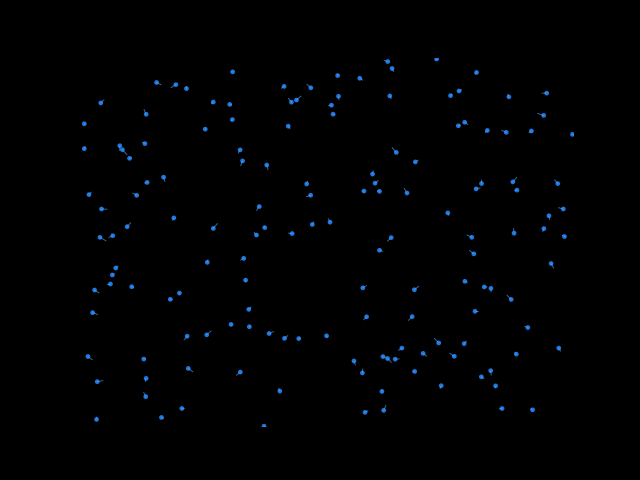

# Nuée d'Oiseaux — Simulation Boids en OCaml



Simulation multi-agents de type **boids** écrite en **OCaml purement fonctionnel** : aucun état mutable, aucun effet de bord non contrôlé, tout est exprimé en `List.map` / `List.fold_left` et en récursion terminale.

Le modèle boids, introduit par Craig Reynolds en 1986, reproduit le comportement collectif d'une nuée d'oiseaux à partir de **trois règles locales** appliquées à chaque agent — sans qu'aucun individu n'ait une vue globale du groupe.

> *L'aperçu ci-dessus a été généré pour illustrer le comportement attendu*

---

## Sommaire

- [Aperçu des règles](#aperçu-des-règles)
- [Architecture](#architecture)
- [Compilation et exécution](#compilation-et-exécution)
- [Arguments en ligne de commande](#arguments-en-ligne-de-commande)
- [Tests](#tests)
- [Paramètres](#paramètres)
- [Ce que ce projet m'a appris](#ce-que-ce-projet-ma-appris)
- [Limites connues](#limites-connues)
- [Pistes d'évolution](#pistes-dévolution)
- [Référence](#référence)
- [Licence](#licence)

---

## Aperçu des règles

À chaque pas de temps, chaque oiseau observe ses voisins dans son rayon de perception et combine trois forces :

- **Séparation** — éviter les voisins trop proches.
- **Alignement** — adopter la direction moyenne du groupe.
- **Cohésion** — se rapprocher du centre de masse local.

Le résultat émergent est une nuée fluide qui se forme, se sépare et se recompose sans qu'aucun comportement global ne soit programmé.

---

## Architecture

Le projet est découpé en cinq modules de bibliothèque indépendants et un exécutable :
_______________________________________________________________________________________________________________________________________________
| Module               | Rôle                                                                                                                 |
|----------------------|----------------------------------------------------------------------------------------------------------------------|
| `lib/vector.ml`      | Vecteurs 2D : addition, soustraction, mise à l'échelle, norme, normalisation, limitation. Aucune dépendance.         |
| `lib/bird.ml`        | Type `bird` (identifiant + position + vélocité), génération aléatoire et déplacement.                                |
| `lib/environment.ml` | Dimensions de la fenêtre, force de répulsion des bords, `clamp` de sécurité.                                         |
| `lib/simulation.ml`  | Cœur algorithmique : calcul des trois règles boids et mise à jour de la liste d'oiseaux.                             |
| `lib/render.ml`      | Affichage via la bibliothèque `Graphics`.                                                                            |
| `bin/main.ml`        | Initialisation, parsing des arguments CLI, boucle infinie de simulation.                                             |
_______________________________________________________________________________________________________________________________________________

Chaque module est accompagné de son fichier `.mli` documenté avec des annotations `ocamldoc`, ce qui permet de générer une documentation HTML autonome (`dune build @doc`).

Dépendances entre modules :

```
vector ──► bird  ──┐
   │               ├──► simulation ──► render ──► main
   └─► environment ┘
```

---

## Compilation et exécution

### Prérequis

- **OCaml** ≥ 4.14
- **Dune** ≥ 3.10
- **opam** pour gérer les dépendances
- Bibliothèque [`graphics`](https://github.com/ocaml/graphics) (nécessite X11 sous Linux, Quartz sous macOS)

### Installation

```bash
# Installer les dépendances OCaml (build + tests)
opam install . --deps-only --with-test

# Compiler
dune build

# Lancer avec les paramètres par défaut (200 oiseaux, fenêtre 800×600)
dune exec bin/main.exe
```

### Arguments en ligne de commande

```bash
dune exec bin/main.exe -- --help
```
___________________________________________________________________________________
| Option         | Valeur par défaut | Description                                |
|----------------|-------------------|--------------------------------------------|
| `--seed N`     | aléatoire         | Seed du générateur, pour reproductibilité. |
| `--n-birds N`  | `200`             | Nombre d'oiseaux dans la nuée.             |
| `--width N`    | `800`             | Largeur de la fenêtre en pixels.           |
| `--height N`   | `600`             | Hauteur de la fenêtre en pixels.           |
| `-h`, `--help` | —                 | Afficher l'aide.                           |
___________________________________________________________________________________

Exemples :

```bash
# Reproductibilité : même seed = même simulation
dune exec bin/main.exe -- --seed 42

# Petite nuée pour debug
dune exec bin/main.exe -- --n-birds 30 --seed 1

# Grand format
dune exec bin/main.exe -- --width 1280 --height 800 --n-birds 400
```

### Contrôles

`Échap` pour Quitter la simulation. 

---

## Tests

Le projet comprend une suite de tests unitaires basée sur [`alcotest`](https://github.com/mirage/alcotest), couvrant :

- les opérations vectorielles (16 tests sur `Vector`) ;
- la construction et le mouvement des oiseaux, y compris la reproductibilité avec seed (5 tests sur `Bird`) ;
- le calcul des forces de bord et la fonction `clamp` (11 tests sur `Environment`) ;
- les règles boids individuelles et les invariants globaux après simulation — conservation du nombre d'oiseaux, des identifiants, respect de `max_speed`, maintien dans la fenêtre (13 tests sur `Simulation`).

Exécution :

```bash
dune runtest
```

---

## Paramètres

Tous les paramètres sont regroupés en tête de `lib/simulation.ml` et `lib/environment.ml` pour faciliter l'expérimentation, et exposés dans les `.mli` pour permettre leur utilisation dans les tests.
___________________________________________________________________
| Paramètre           | Valeur | Rôle                             |
|---------------------|--------|----------------------------------|
| `perception_radius` | `60.`  | Rayon de vision de chaque oiseau |
| `separation_radius` | `20.`  | Distance minimale entre oiseaux  |
| `max_speed`         | `3.`   | Vitesse maximale                 |
| `max_force`         | `0.05` | Force de virage maximale         |
| `sep_weight`        | `1.5`  | Poids de la séparation           |
| `align_weight`      | `1.0`  | Poids de l'alignement            |
| `cohes_weight`      | `1.0`  | Poids de la cohésion             |
| `margin`            | `50.`  | Zone de répulsion des bords (px) |
| `turn_factor`       | `0.3`  | Force de rappel vers l'intérieur |
___________________________________________________________________

> Augmenter `sep_weight` casse la nuée en petits groupes ; augmenter `cohes_weight` la condense ; baisser `max_force` produit des mouvements plus lisses et plus inertes.

---

## Ce que ce projet m'a appris

- **Conception modulaire en OCaml.** Chaque module a un rôle unique (vecteurs, agent, environnement, règles, rendu, point d'entrée) et expose son contrat via une signature `.mli`. Cette discipline force à raisonner sur l'interface avant l'implémentation.
- **Le typage comme outil de documentation.** Les `.mli` font office de spécification : un lecteur peut comprendre ce que fait chaque fonction sans lire son corps.
- **Le paradigme fonctionnel pur appliqué à un système dynamique.** Aucune `ref`, aucun tableau mutable, aucune variable globale. Chaque pas de simulation transforme la liste d'oiseaux via `List.map`, et la boucle principale est une récursion terminale.
- **Trois règles locales suffisent à produire un comportement collectif riche.** Aucun oiseau n'a une vue globale du groupe, et pourtant la nuée émerge naturellement  un cas d'école de système distribué.
- **L'importance des tests sur un système simulé.** Sans état observable de l'extérieur, les tests d'invariants (nombre d'oiseaux préservé, vitesse bornée, oiseaux toujours dans la fenêtre) sont les seuls remparts contre les régressions silencieuses.
- **Le coût d'une approche naïve.** La recherche de voisins en O(n²) devient le goulot d'étranglement dès qu'on dépasse quelques centaines d'agents.

---

## Limites connues

- **Complexité O(n²)** : à chaque pas, chaque oiseau examine tous les autres pour trouver ses voisins. Cela limite la simulation à environ 500 oiseaux à 60 fps sur une machine standard. 
- **Rendu mono-thread, synchrone.** Le calcul et le rendu sont entrelacés dans la même boucle ; un pic de calcul gèle l'affichage.
- **Pas de gestion d'obstacles ni de prédateurs.** Le monde est un rectangle vide.
- **Fenêtre de taille fixe** une fois la simulation lancée. Pas de redimensionnement à la volée.
- **Dépendance à `Graphics`**, qui est une bibliothèque vieillissante et requiert X11 sous Linux. Un portage vers `tsdl` ou `raylib-ocaml` rendrait le projet plus portable.

---

## Gestion des bords

Plutôt qu'un *wrap* qui téléporterait les oiseaux d'un bord à l'autre, `environment.ml` applique une **force de rappel progressive** dès qu'un oiseau entre dans la zone marginale (50 px des bords). Le résultat : des virages naturels au lieu de transitions brutales.

La fonction `clamp` reste un filet de sécurité : elle restreint les coordonnées à `[1, largeur-1] × [1, hauteur-1]` au cas où un oiseau traverserait quand même.

---

## OCaml fonctionnel pur

L'implémentation respecte strictement le paradigme fonctionnel :

- pas de `ref`, pas de tableaux mutables, pas de variables globales ;
- `List.map` et `List.fold_left` remplacent toutes les boucles impératives ;
- chaque fonction retourne une nouvelle valeur sans modifier ses arguments ;
- la boucle principale est une **récursion terminale** ;
- les types `vector`, `bird` et `environment` sont des **records immuables**.

Cette discipline garantit l'absence d'effets de bord non contrôlés et rend chaque fonction individuellement testable.

---

## Pistes d'évolution


- **Obstacles** statiques avec leur propre force de répulsion.
- **Prédateurs** : un second type d'agent qui pourchasse les oiseaux et déclenche une force de fuite.
- **Contrôles temps réel** : ajuster les poids des trois règles au clavier pour visualiser leur effet immédiat.
- **Backend graphique moderne** (`tsdl`, `raylib-ocaml`) pour s'affranchir de X11.
- **Rendu 3D** en passant à une autre bibliothèque graphique.

---

## Structure du dépôt

```
nuee-oiseaux/
├── bin/
│   ├── dune
│   └── main.ml             # Point d'entrée + parsing CLI
├── lib/
│   ├── dune
│   ├── vector.ml(i)        # Vecteurs 2D
│   ├── bird.ml(i)          # Agent oiseau
│   ├── environment.ml(i)   # Fenêtre + bords
│   ├── simulation.ml(i)    # Règles boids
│   └── render.ml(i)        # Affichage Graphics
├── test/
│   ├── dune
│   ├── test_birds.ml       # Runner Alcotest
│   ├── test_vector.ml      # 16 tests
│   ├── test_bird.ml        # 5 tests
│   ├── test_environment.ml # 11 tests
│   └── test_simulation.ml  # 13 tests
├── doc/
│   ├── boids_ocaml.pdf     # Document de conception
│   └── preview.gif         # Aperçu de la simulation
│   
├── .github/workflows/
│   └── ci.yml              # Build + tests sur GitHub Actions
├── .gitignore
├── .ocamlformat
├── LICENSE                 # MIT
├── README.md
└── dune-project
```

---

## Référence

Reynolds, Craig W. *Flocks, herds and schools: A distributed behavioral model.* SIGGRAPH '87 — l'article fondateur du modèle boids.

---

## Licence

Distribué sous licence **MIT**. Voir le fichier [`LICENSE`](LICENSE).
